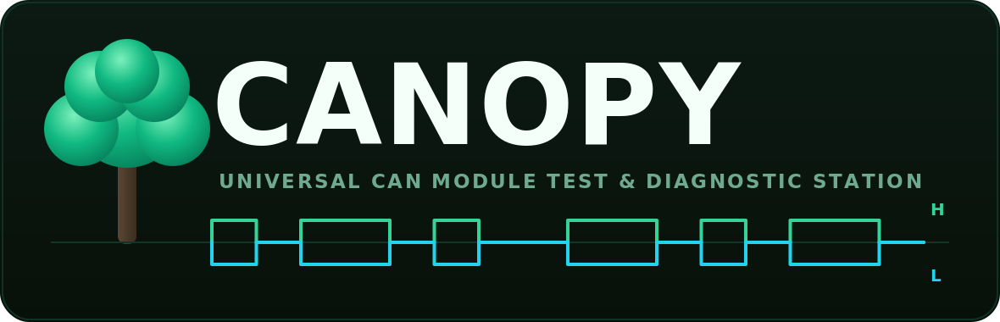

<p align="center">
  
</p>

<h1 align="center">CANOPY</h1>

<p align="center">
  <b>CAN-Anchored Reliability & Anomaly Recording sYstem</b><br>
  A universal bench station that tests automotive ECUs/modules over CAN, simulates the
  rest of the vehicle, and turns every test into ranked fault diagnoses and wiki knowledge.
</p>

<p align="center">
  <code>Phase 0 — Bus MVP</code> ·
  <code>Python ≥ 3.10</code> ·
  <code>Linux / SocketCAN</code> ·
  <code>develop on vcan0, deploy on can0</code>
</p>

---

## What CANOPY does

Plug an automotive module onto the bench, pick its profile, hit **run**. The station:

1. **Powers it correctly** (regulated 12V/KL30, switched ignition/KL15, ground) with
   per-profile current limits set *before* energize.
2. **Wakes it and simulates the rest of the vehicle bus** (*restbus*) — broadcasting the
   periodic frames the absent ECUs would send, so the module leaves limp/sleep mode and
   behaves as if installed.
3. **Runs diagnostics** over CAN / CAN FD / UDS / OBD-II / J1939 — DTC read/clear,
   ReadDataByIdentifier, routine control, security access.
4. **Measures power & signal behavior** — quiescent/sleep/inrush current signatures,
   rail voltages, CAN-H/CAN-L differential integrity.
5. **Produces a pass/fail report with a ranked list of most-likely _component-level_
   root causes** — e.g. *"U3 5V LDO open"*, *"CAN transceiver TXD stuck low"*,
   *"corroded pin 12"*, *"Q5 shorted"*.

Every run also writes a raw CAN trace, instrument telemetry, and a structured **Case**
record. Those labeled cases are simultaneously (a) the diagnosis training data and (b)
the content of the internal repair wiki — so the system gets smarter with every module.

### Two more force-multipliers

- **Wiring-diagram vision onboarding.** Upload a screenshot of a connector pinout →
  Claude vision extracts it → CANOPY drafts the adapter-harness mapping and module
  profile. A **mandatory human confirm-before-energize** step verifies power/ground/CAN
  pins before the switch matrix closes any relay. Vision is never trusted to auto-energize.
- **Hardware- and module-agnostic by design.** Instruments live behind a Hardware
  Abstraction Layer; module behavior lives in YAML profiles. Adding a module = adding a
  profile (+ a cheap adapter harness). Swapping a CANable for a Kvaser is a config change.

See [CLAUDE.md](CLAUDE.md) for the full architecture and data model,
[docs/ARCHITECTURE-NOTES.md](docs/ARCHITECTURE-NOTES.md) for the universal-interface/PCB and
full-car-simulator design, and [docs/BATTLE-PLAN.md](docs/BATTLE-PLAN.md) for the build-out plan.

---

## The "Universal Interface" — three layers, not one connector

```
 Module connector ─► Adapter harness ─► Standard test header ─► Switch matrix ─► Station resources
  (per-module)        (per-module,         (fixed, e.g.            (relay/FET,      (12V, GND, CAN-H/L,
                       cheap, library)      40-pin)                 16–32 ch)        wake, loads, taps)
```

Fixed station resources are routed by a software-controlled switch matrix onto a fixed
test header; a cheap per-module adapter harness maps any module's proprietary connector
to that header. This is how a generic proprietary plug becomes something `canopy` can read.

---

## Status — Phase 0 (Bus MVP), zero hardware required

The whole point of SocketCAN's virtual bus (`vcan0`) is that the entire stack is
buildable and testable before a single relay clicks.

**Shipped now:**

| Module | What it does |
|---|---|
| [`canopy/hal/can_iface.py`](canopy/hal/can_iface.py) | Backend-agnostic `python-can` wrapper (SocketCAN default). The one HAL driver in this phase. |
| [`canopy/decode.py`](canopy/decode.py) | `cantools` signal-level DBC decode. |
| [`canopy/trace.py`](canopy/trace.py) | Vector-compatible **BLF** raw-trace logging + replay. |
| [`canopy/cli.py`](canopy/cli.py) | `send`, `monitor`, `decode` commands. |
| [`tests/`](tests/) | Round-trip + decode + trace tests against `vcan0`, falling back to an in-process `virtual` bus on CI. |
| [`docker-compose.yml`](docker-compose.yml) | Postgres + TimescaleDB + pgvector (provisioned now; schema lands in Phase 1). |

**Not yet implemented** (later phases): UDS/OBD diagnostics, restbus simulation, module
profiles, PSU/INA228/matrix/scope drivers, vision pipeline, diagnosis engine, web UI.

---

## Install

```bash
python -m venv .venv && source .venv/bin/activate
pip install -e ".[dev]"
```

Requires Python ≥ 3.10 on Linux (SocketCAN).

---

## Creating `vcan0` (virtual CAN) locally

SocketCAN ships a virtual CAN driver — bring up `vcan0` and the whole stack runs with no
hardware:

```bash
sudo modprobe vcan
sudo ip link add dev vcan0 type vcan
sudo ip link set up vcan0
ip -details link show vcan0          # verify
```

Tear down with `sudo ip link delete vcan0`. Inspect traffic with `can-utils`
(`sudo apt install can-utils`):

```bash
candump vcan0                        # terminal 1
cansend vcan0 123#01020304           # terminal 2
```

> **CI / no privileges:** the test suite auto-detects whether `vcan0` is available and
> falls back to python-can's in-process `virtual` backend, so `pytest` passes without
> `sudo` or kernel modules.

---

## CLI

Running `canopy` with no command prints the banner and help:

```
   ██████╗ █████╗ ███╗   ██╗ ██████╗ ██████╗ ██╗   ██╗
  ██╔════╝██╔══██╗████╗  ██║██╔═══██╗██╔══██╗╚██╗ ██╔╝
  ██║     ███████║██╔██╗ ██║██║   ██║██████╔╝ ╚████╔╝
  ██║     ██╔══██║██║╚██╗██║██║   ██║██╔═══╝   ╚██╔╝
  ╚██████╗██║  ██║██║ ╚████║╚██████╔╝██║        ██║
   ╚═════╝╚═╝  ╚═╝╚═╝  ╚═══╝ ╚═════╝ ╚═╝        ██║
   Universal CAN Module Test & Diagnostic Station
```

```bash
# Send a frame (id and payload are hex)
canopy send vcan0 123 01020304

# Watch the bus for 5s, decode against a DBC, and save a BLF trace
canopy monitor vcan0 --timeout 5 --dbc dbc/platform.dbc --trace

# Decode a recorded BLF trace
canopy decode traces/20260626T184500Z_monitor.blf --dbc dbc/platform.dbc
```

Self-test loop on one machine:

```bash
canopy monitor vcan0 --timeout 10 &   # listen
canopy send vcan0 123 deadbeef        # transmit
```

Config can also come from the environment (`CANOPY_CAN_INTERFACE`, `CANOPY_CAN_CHANNEL`,
`CANOPY_CAN_BITRATE`, `CANOPY_CAN_FD`, …); CLI flags win.

---

## Database (provisioned now, used from Phase 1)

```bash
docker compose up -d db      # Postgres + TimescaleDB + pgvector on :5432
```

Credentials `canopy` / `canopy`, database `canopy`. The init script enables the
`timescaledb` and `vector` extensions on first boot.

---

## Tests & lint

```bash
pytest          # runs against vcan0 if present, else the virtual backend
ruff check .
```

---

## USB-to-CAN adapter requirements

CANOPY is anchored to **Linux + SocketCAN**, which dictates the adapter:

- **Must present as a native SocketCAN device** (`can0`), not a serial port. The whole
  stack (`python-can`, `can-isotp`, `udsoncan`) builds on this.
- **CAN FD capable** — the roadmap targets CAN / CAN FD / J1939.
- **Avoid ELM327/slcan dongles** as the primary interface (poor timing/buffering, awkward
  for ISO-TP/UDS) and **MCP2515 SPI HATs** for production (fine as a cheap 2nd channel).

| Stage | Adapter | Why |
|---|---|---|
| Dev / MVP | **CANable 2.0** (`gs_usb`/candleLight, CAN FD, ~$50) | Native SocketCAN, cheap |
| Production | **PEAK PCAN-USB FD** or **Kvaser Leaf** | Rock-solid drivers + timing |
| Multi-channel | **Kvaser USBcan Pro 2xHS** / **PEAK PCAN-USB Pro FD**, or 2× CANable as `can0`/`can1` | Restbus on one bus while testing the DUT on another; bridging |

Phase 0 needs none of this — `vcan0` covers everything until real hardware in Phase 2.

---

## Deploying on real hardware

Develop on `vcan0`, deploy on `can0` — no code changes, just config:

```bash
sudo ip link set can0 up type can bitrate 500000
canopy monitor can0 --timeout 5
```

---

## Roadmap

| Phase | Deliverable |
|---|---|
| **0 — Bus MVP** ✅ | `vcan0` dev loop; send/receive; DBC decode; BLF logging; CLI |
| **1 — Diagnostics** | UDS/OBD over ISO-TP; DTC read/clear; restbus sim; Postgres logging |
| **2 — Power & profiles** | PSU control + INA228 current logging; power sequencing; module-profile YAML |
| **3 — Matrix** | Relay matrix + adapter-harness library; automated pin routing |
| **4 — Vision** | Wiring-diagram → pinout → draft profile (human-in-the-loop confirm) |
| **5 — Learning** | Rules engine + pgvector similarity; wiki export |
| **6 — Scale** | Web UI, multi-DUT, gateway-mode OBD, trained classifier |
